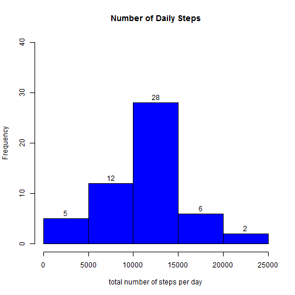
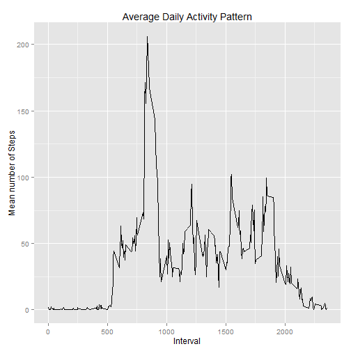
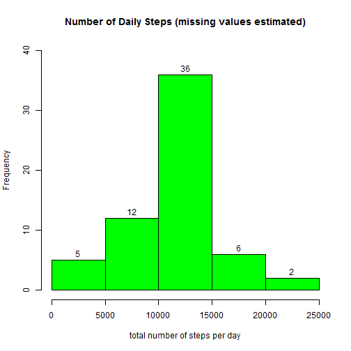
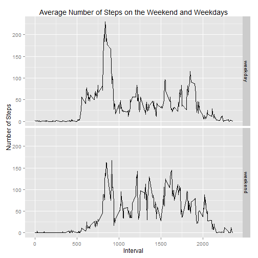

## Overview
This analysis of Activity Monitoring Data makes heavy use of **R's dplyr**.  For information on the data files and fields please see the Readme or the doc/instructions.  Remember to set your current working directory to the location of this file.

## Loading and preprocessing the data

```r
library(dplyr)
library(datasets)
library(ggplot2)

#read the data
data <- read.csv("activity/activity.csv", 
                 colClasses=c("integer","Date","integer"))

#create a data frame with the na's removed 
data_tbl <- tbl_df(data)
data_no_na_tbl <- filter(data_tbl, !is.na(steps)) #remove na
```
The activity data file has many rows with missing data (NA).  These files were
removed for our initial analysis.


## What is mean total number of steps taken per day?

```r
no_na_date <- group_by(data_no_na_tbl, date)        #group by date
steps_per_day <- summarize(no_na_date, sum(steps))  #calc sum
colnames(steps_per_day) <- c("date","total")


#histogram of total number of steps per day
hist(steps_per_day$total, xlab = "total number of steps per day", 
     labels = TRUE, ylim = c(0,40), main = "Number of Daily Steps",
     col = "BLUE")
```

 

```r
#mean/median total number of steps taken per day.
results <- summarize(steps_per_day, mean = mean(total), median = median(total))
```
The mean total number of steps per day is 1.0766189 &times; 10<sup>4</sup>.
The median total number of steps per day is 10765.


## What is the average daily activity pattern?

```r
#average daily activity pattern
no_na_interval <- group_by(data_no_na_tbl, interval)
avg_steps_per_interval <- summarize(no_na_interval, mean = mean(steps))

qplot(interval,mean,data = avg_steps_per_interval,geom = "line",
      main = "Average Daily Activity Pattern", 
      ylab = "Mean number of Steps", 
      xlab = "Interval" )
```

 

```r
#interval with max avg steps
max_index <- which.max(avg_steps_per_interval$mean)         
max_interval <- avg_steps_per_interval[max_index,]
```
The average daily activity pattern shows that interval 835 has the maximum average steps with the value 206.1698113 .

This value corresponds with the graph were we can see a morning spike.  

## Imputing missing values

```r
##################################################################
# Missing Values - lots of NA in steps column could skew data
##################################################################
#copy original data set
calc_data <- data_tbl

# get a list of indices of NA rows 
missing_rows<- which(is.na(calc_data$steps))

#number of missing values in the dataset.
num_na_rows <- length(missing_rows)
```

**There are 2304 rows that did not record a value for steps.**  By omitting those rows there is a chance our findings are skewed.  
  
To correct against that likelihood we replaced missing data.  

1.  The first replacement attempted is the average of the interval corresponding to the missing data point.  *(for example if there is a missing data for interval 1000 on October 2, 2012 then the average for interval 1000 is used.)*
2.  Otherwise, if there is no average available for an interval (all the values were missing) then the overall average was used.  *(for this particular data set this step was not used but kept for error handling completeness)*


```r
#calculate the overall average number of steps per interval
total_avg <- summarize(avg_steps_per_interval, avg = mean(mean))


# loop through indices and replace the na value with the rounded mean
# for that interval
for(i in 1:num_na_rows) {
      
    #determine which row in avg_steps_per_interval corresponds to  
    #the na row
    index <- which( avg_steps_per_interval$interval == 
                    calc_data[ missing_rows[i],]$interval)
              
              
    #double check that an average exists for this interval and replace na 
    #with average for the interval
    if (index > 0)
    {
        calc_data[missing_rows[i],]$steps <- round(avg_steps_per_interval[index,]$mean)
    }
    #it is possible avg for interval doesn't exist (for na for that interval 
    #for all days - use overall mean
    else
    {
        calc_data[missing_rows[i],]$steps <- total_avg$avg
    }
}

#histogram of total number of steps per day
calc_data_tbl <- tbl_df(calc_data)
calc_date <- group_by(calc_data_tbl, date)          #group by date
steps_per_day <- summarize(calc_date, sum(steps))   #calc sum
colnames(steps_per_day) <- c("date","total")

results_calc <- summarize(steps_per_day, 
                          mean = mean(total), 
                          median = median(total))

hist(steps_per_day$total, 
     xlab = "total number of steps per day", 
     labels = TRUE, 
     ylim = c(0,40), 
     main = "Number of Daily Steps (missing values estimated)",
     col = "green")
```

 
   
   
You will note that this histogram differs from our prior results.  The middle 
bar for the interval 10000 to 15000 increased significantly from 28 to 36.

**The mean total number of steps per day is 1.0765639 &times; 10<sup>4</sup> versus 
1.0766189 &times; 10<sup>4</sup>.
The median total number of steps per day is 1.0762 &times; 10<sup>4</sup> versus 
10765. **

Replacing the missing or "NA" values with reasonable estimates 
changes our understanding of the number of daily steps.


## Are there differences in activity patterns between weekdays and weekends?

One thing to consider is whether there is a difference between weekdays and 
weekends activity levels and timing.  


```r
##########################################################################
# Weekday vs Weekend
##########################################################################
# add a column to calculated data indicating weekend or weekday
calc_data_day <- mutate(calc_data_tbl, 
       day_type = ifelse ((weekdays(as.Date(date)) %in% c('Saturday','Sunday')),
                         'weekend','weekday'))

#average daily activity pattern - for both weekend and weekday calculate the 
#                                 average for each interval
calc_data_group <- group_by(calc_data_day, day_type, interval )
avg_steps <- summarize(calc_data_group, mean = mean(steps))

# 2 panel plot (weekend/weekday) of the average steps per interval 
qplot(interval, mean, data = avg_steps, geom = "line", 
      ylab = "Number of Steps", xlab = "Interval", 
      main = "Average Number of Steps on the Weekend and Weekdays",
      facets = day_type ~.)
```

 
   
   
   
As illustrated in the graphs, activity in the weekend starts and ends later than
the weekday.  The weekend does not show the intense level of activity in the 
morning but rather a more even mid-level activity throughout the day.  
